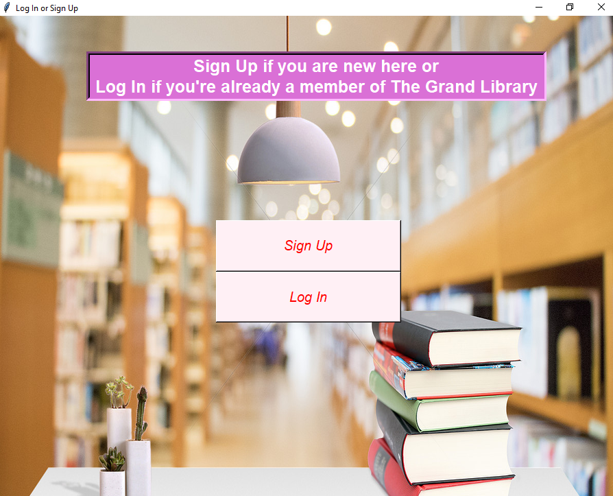
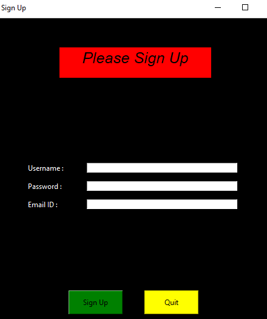
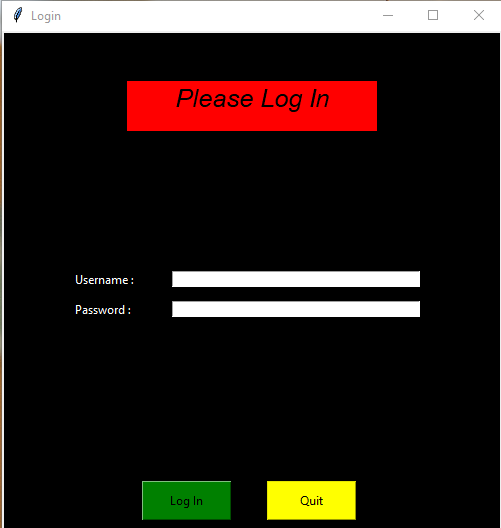
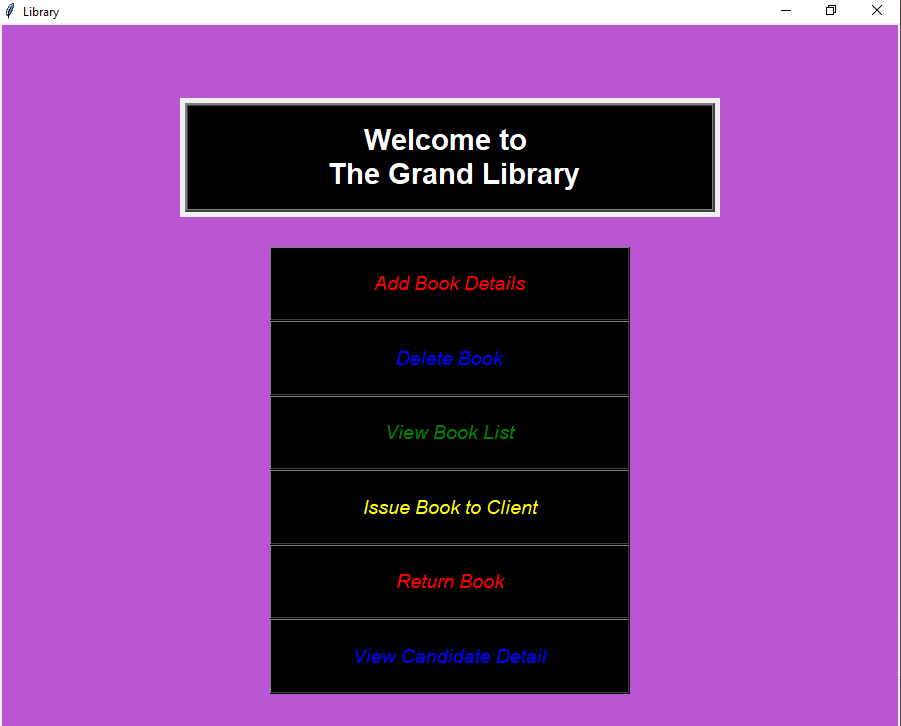
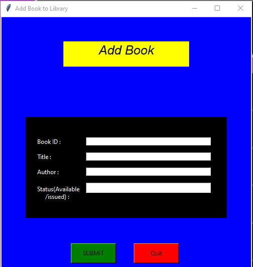
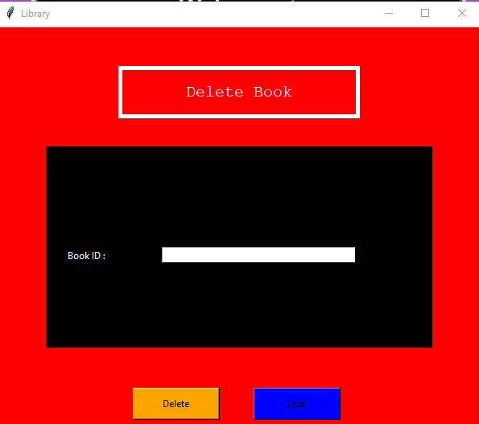
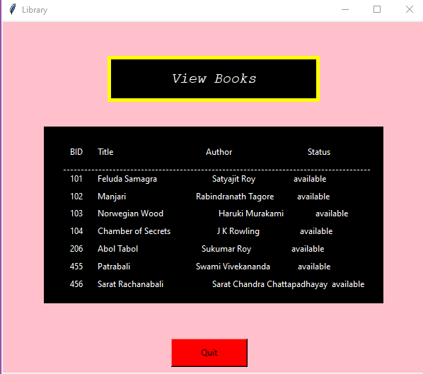
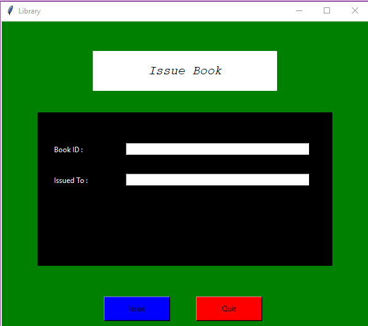
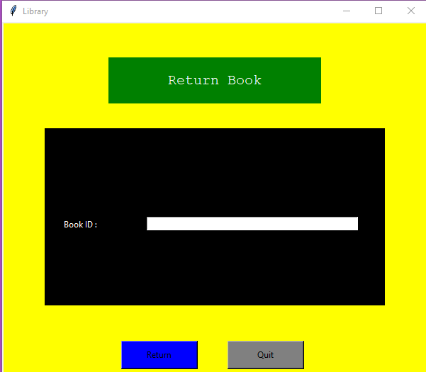
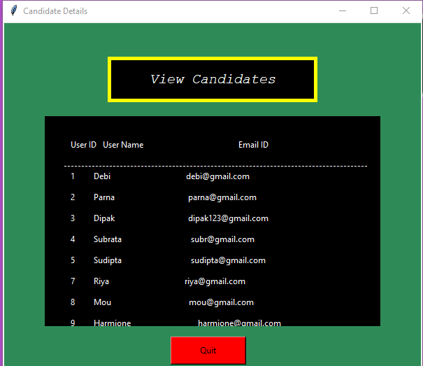

# Project Title:
**Online Library Management System**

# Description:

 An interactive web portal for automating various manual processes done by a librarian.

 # Abstract

 Manual process of keeping member records, book records, library details, managing library candidates is very difficult. There are various problems also faced by the members in library such as finding any particular book, information whether book is available or not, searching of books using Book ID,return a book that has been already issued etc. To eliminate this manual system, an Online Library Management System has been developed.

 # Code Features:

  1. Sign up if the individual is new to the library
  2. Log in if the individual is already a member of the library
  3. Adding books
  4. Issuing books
  5. Deleting books
  6. View list of the available books along with book details
  7. Returning books
  8. View details of the members


 # Technology Stack Used:

 Front End : **Python Tkinter**
 
 Back End : **Python , MySQL**
 
 Database :  **MySQL**

 # Requirements:

 The source code of this project is written in **Python**. So, we need Python to be installed in our machine.
 The database required for this project is **MySQL**. So, I installed **XAMPP** in order to work with MySQL server. Here, we made the required MySQL database.

# How it works:

  If a member signs up , the information of them will be saved to the Database we created in MySQL server. Same will be occurred when a book is added as well. In the home page ,We can view the member details and book details also. If we delete a book, the book will be deleted from the specific table of the database. After logging in or signing up, A  member can issue a available book or return a book which has been already issued.
  
# Required libraries and modules:

```
from tkinter import *
from PIL import ImageTk,Image 
import pymysql
from tkinter import messagebox
```
# Connecting to MySQL server:
```
con = pymysql.connect(host="localhost",user="root",password='',database='db1')
cur = con.cursor()
```

# Screenshots:

### Log In/Sign Up Page



### Sign Up Screen



### Log In Screen 


### Home Screen


### Add Book Page


### Delete Book Page


### View Books


### Issue Book Page


### Return Book Page


### View Candidates



# THANK YOU!!

  
